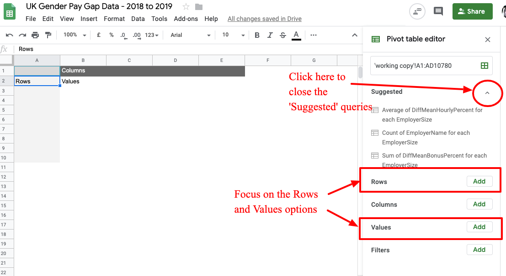
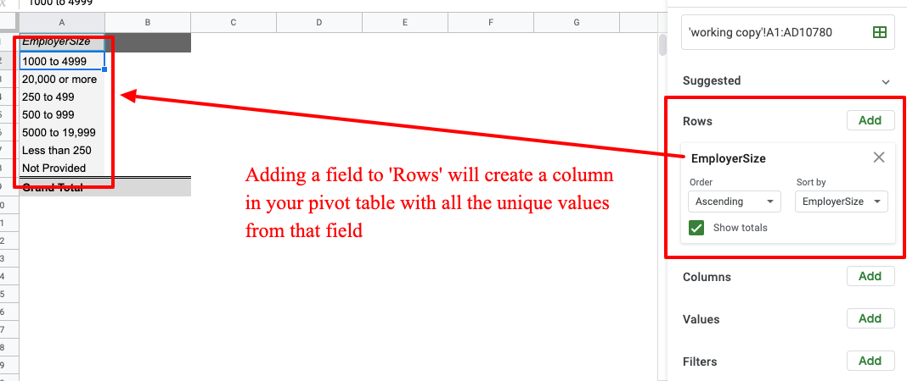
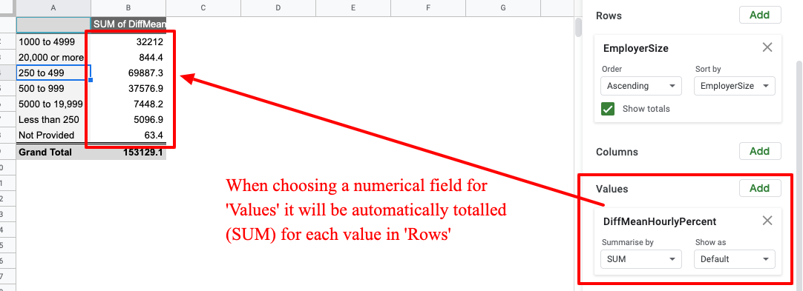
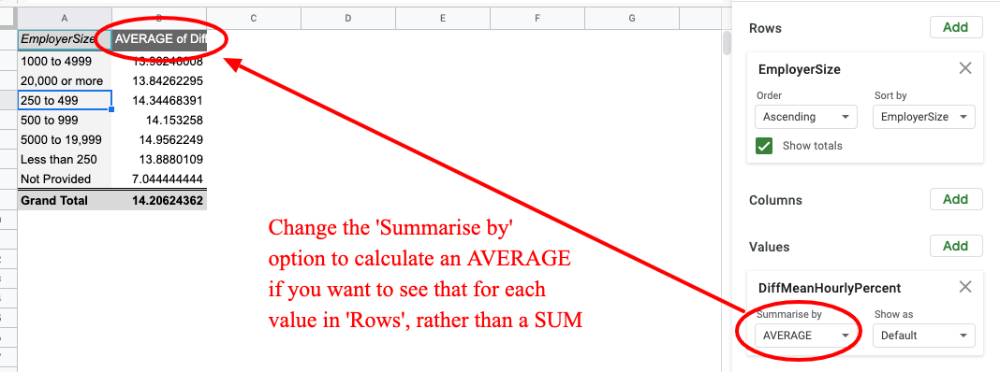
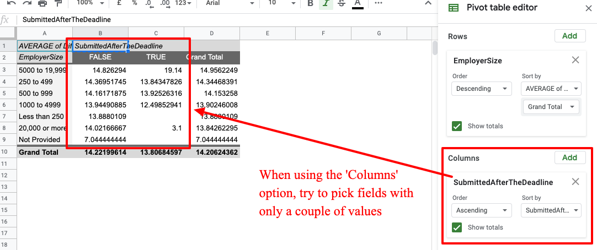
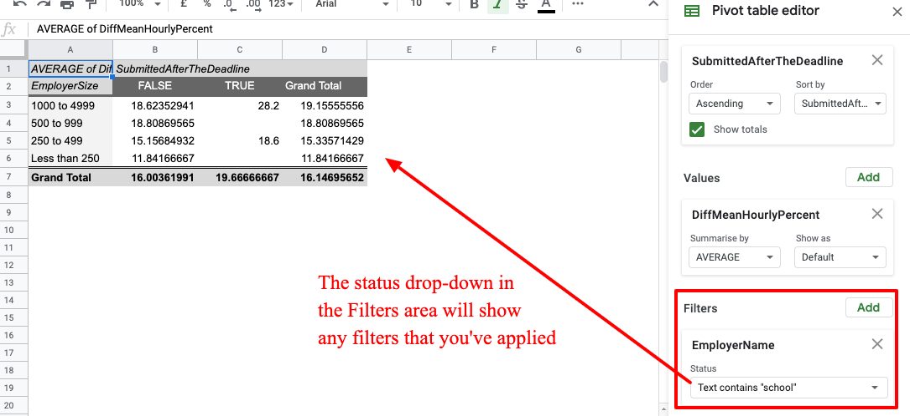

# Using pivot tables in Google Sheets

To create a pivot table in Google Sheets, make sure you are somewhere in your data, and select **Data > Pivot table...**. A window will appear asking you if you want to create that pivot table in a new sheet or the existing sheet. Leave *New sheet* selected, and click **Create**.

As in Excel, a new sheet will be created with an empty pivot table on the left, and on the right the *Pivot table editor*.

This pivot table editor is structured in a slightly different way to the way it is designed in Excel, but it contains the same basic elements: four areas where you can specify what (if anything) you want in the rows, columns, and values (middle), and any filters. Next to each of these is a button marked **Add**.

(In addition, above these 4 areas Google Sheets will also often provide a list of *Suggested* queries. This does have an annoying habit of taking up unnecessary space, so make sure to click on the upward facing triangle next to that list to minimise those suggestions and make more room for the bits you want to work with...)

For many pivot tables you will only need to use the *Rows* and *Values* options: these allow you to specify what aspect of your data you want to aggregate by (e.g. a category column), and what aspect of your data you want to calculate with (e.g. what you want to count, or add up, or average etc.).

We will focus on those first, then move on to the less-used *Column* and *Filters* options.

## Using the rows and values options

Click on the **Add** button next to *Rows*: this should drop-down a list of all the fields (column names) in your data. Select the one you want to aggregate by. For example, with [gender pay gap data](https://gender-pay-gap.service.gov.uk/viewing/download), you might pick 'EmployerSize' (there are seven categories) or 'SubmittedAfterTheDeadline' (there are two options) but there is no point choosing 'EmployerName' because each name only appears once in the original data, so any totals, averages, maximum or minimum values will just be the same as the value for that company in the spreadsheet etc. (because each company only has one number to add up or average, and that number will be both that company's maximum and minimum value!)

In contrast, if you were working with [council expenditure data](https://www.westminster.gov.uk/spending-procurement-and-data-transparency) you might pick a company name (recipient) to aggregate by because one company can appear more than once and you may want to aggregate all the separate payments to each company into a total per company.

Let's say we pick 'EmployerSize', then. The next step is to specify what we want to *calculate* for each of the seven categories in that column. This is done by clicking on the **Add** button next to *Values*. Once again, this will open up a list of all the fields in the data.

Before you pick the value, decide what calculation you want to perform. Your options include:

* Counting how many entries there are (in this case, how many companies in each category)
* Totalling all the values for each item in the row (for example the total money paid to each company in the rows)
* Calculating an average for each (for example the average payment to each company, or the average pay gap for companies in each category). In Google Sheets you can calculate two types of average: the mean average, or a median. This is one major advantage over Excel, which only allows you to calculate mean averages.
* Showing the minimum or maximum value for each (for example each company's biggest or smallest single payment, or each category's biggest or smallest pay gap)

For anything except *counting*, you need to pick a numeric column.

Continuing with the gender pay gap data, click on the **Add** button next to *Values* and select 'DiffMeanHourlyPercent'. This shows the difference in average pay between men and women (with a positive figure indicating a percentage in favour of men, and a negative one indicating that women earn more per hour on average).

By default, the pivot table will *add up* all those averages, resulting in some odd looking figures: are companies with 1000 to 4999 employees really paying men 32212% more than women? No. (Always ask yourself if totals make sense and try to work out step-by-step how it arrived at the figure it has)

In this case, we want to perform a different calculation, so click on the *Summarise by* drop-down menu that currently says *SUM* (in other words, totals) and change it to *AVERAGE*.

The figures should change to figures which represent the average value for each category (generally around 13-14%). Note also that the heading for the column containing those values also changes, from *SUM of DiffMeanHourlyPercent* to *AVERAGE of DiffMeanHourlyPercent*.

If we wanted to calculate the total number of entries in each category, we could change it again, from *AVERAGE* to *COUNT*.

Note: a *COUNT* calculation will *only count numbers*, not text or empty. So any cells related those categories that don't have numbers won't be counted. If you want to count text and number entries, use *COUNTA* instead (this still won't count blank cells in the field selected).

By default, the pivot table will be sorted by the first column - but chances are that you will prefer to sort it by those aggregated values, so that either biggest or smallest totals come top. To sort your pivot table this way, go back to your *Rows* section and look at the two drop-down menus there: *Order* and *Sort by*.

Change *Sort by* so that it sorts by your value calculation instead: this will be the only other option and will have the same title as the second column, e.g. 'AVERAGE of DiffMeanHourlyPercent'.

By default it will bring the smallest values to the top. If you want to sort it from biggest to smallest instead, change the *Order* drop-down from Ascending to *Descending* too.

Now we can see, in order, which categories of company have the biggest gender pay gaps.

## Adding columns

So far we've left the other two options - *Columns* and *Filters* - untouched. There's a good reason for this: adding columns often over-complicates a pivot table, and filters are often best applied in the data itself (by creating an extra categorical column for example) rather than at this stage.

Columns can be useful, however, when we choose a field with only a few values. For example, the field 'SubmittedAfterTheDeadline' only has two values: TRUE and FALSE.

Let's use that, then: in the *Columns* area, click on **Add** and select 'SubmittedAfterTheDeadline'.

You should see the previous single column now change to three: one each for the TRUE and FALSE values, plus a Grand Total column.

The values will now change to reflect this new structure: instead of calculating an average (or total, or count, etc.) for each category in the rows, it will now perform that calculation for each combination of row-and-column property. So for example:

* What is the average of all the values where 'EmployerSize' is "5000 to 19,999" and 'SubmittedAfterTheDeadline' is "TRUE"
* What is the average of all the values where 'EmployerSize' is "5000 to 19,999" and 'SubmittedAfterTheDeadline' is "FALSE"
* What is the average of all the values where 'EmployerSize' is "250 to 499" and 'SubmittedAfterTheDeadline' is "TRUE"
* And so on.

## Adding filters

The final area to explore is the *Filters* option.

Click on **Add** next to this and select 'EmployerName'.

You now have a box within that *Filters* area with a *Status* drop-down menu that says *Showing all items*. If you click on that menu you can change that filter just as you can change a filter in the spreadsheet itself.

To begin with the *Filter by values...* area will be expanded, with 'Select all' and 'Clear' just beneath it, then under those, a search box, and under that a list of the first few items.

You can click 'Clear' to clear the current selection (all items) and then manually tick the ones you want to keep in your filter (you can use the search box to search for those and then tick them, but it's still a laborious process).

But an easier option is to look *above* the *Filter by values...* area, to where the *Filter by condition...* area is tucked away. Expand this by clicking on the right-pointing triangle next to it, so you can see a drop-down menu that says *None*. Click on that menu and you will see a number of filtering options ranging from text-related filters such as *Text contains*, to date-, and finally number-related filters.

Select *Text contains* and type 'school' into the box that appears.

Now the status should change to *Text contains "school"* and the pivot table values will change to reflect the new filter being applied.

## Closing filters, removing columns, rows or calculations

To close your filter, simply click the X in the upper right corner of the *Filters* box (below the **Add** button). Do the same to remove any columns, rows, or calculations.

## Copying results to keep later (for visualisation, for example)

Once you've performed a calculation you want to keep, it's worth copying it into a sheet on its own. If you do this, it's a good idea to use the special *Edit > Paste special > Paste values only* option.

Pasting as values only means that you only paste the *results* of the pivot table, not all the calculations involved. This is preferable because it uses up less memory and keeps your spreadsheet working faster.
